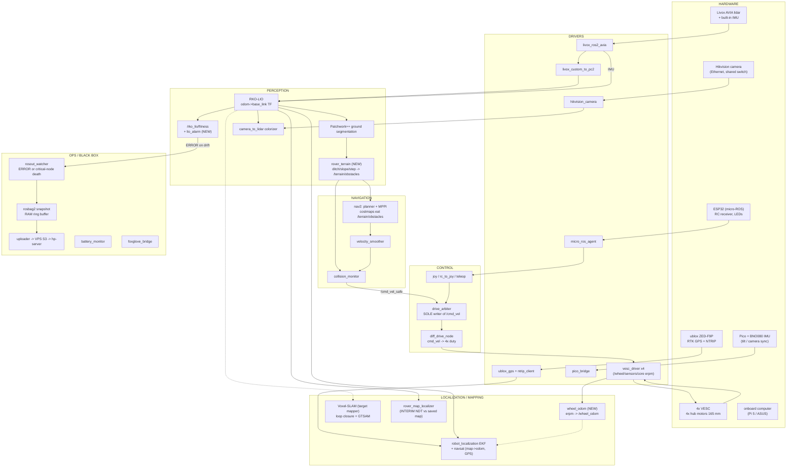

# The robot — hardware & software graph

```mermaid
flowchart TB
    subgraph hw [HARDWARE]
        AVIA["Livox AVIA lidar\n+ built-in IMU"]
        CAM["Hikvision camera\n(Ethernet, shared switch)"]
        GPS["ublox ZED-F9P\nRTK GPS + NTRIP"]
        PICO["Pico + BNO080 IMU\n(tilt / camera sync)"]
        ESP["ESP32 (micro-ROS)\nRC receiver, LEDs"]
        VESC["4x VESC\n4x hub motors 165 mm"]
        PC["onboard computer\n(Pi 5 / ASUS)"]
    end

    subgraph drivers [DRIVERS]
        LIVOXD[livox_ros2_avia]
        PC2[livox_custom_to_pc2]
        CAMD[hikvision_camera]
        UBX[ublox_gps + ntrip_client]
        PICOB[pico_bridge]
        URA[micro_ros_agent]
        VESCD["vesc_driver x4\n(/wheel/sensors/core erpm)"]
    end

    subgraph perception [PERCEPTION]
        LIO["RKO-LIO\nodom->base_link TF"]
        FIT["/rko_lio/fitness\n+ lio_alarm (NEW)"]
        PW[Patchwork++ ground segmentation]
        TERR["rover_terrain (NEW)\nditch/slope/step -> /terrain/obstacles"]
        COLOR[camera_to_lidar colorizer]
    end

    subgraph loc [LOCALIZATION / MAPPING]
        EKF["robot_localization EKF\n+ navsat (map->odom, GPS)"]
        WODO["wheel_odom (NEW)\nerpm -> /wheel_odom"]
        VS["Voxel-SLAM (target mapper)\nloop closure + GTSAM"]
        MLOC["rover_map_localizer\n(INTERIM NDT vs saved map)"]
    end

    subgraph nav [NAVIGATION]
        NAV2["nav2: planner + MPPI\ncostmaps eat /terrain/obstacles"]
        CM[collision_monitor]
        SM[velocity_smoother]
    end

    subgraph control [CONTROL]
        JOY["joy / rc_to_joy / teleop"]
        ARB["drive_arbiter\nSOLE writer of /cmd_vel"]
        DD["diff_drive_node\ncmd_vel -> 4x duty"]
    end

    subgraph ops [OPS / BLACK BOX]
        WATCH["rosout_watcher\nERROR or critical-node death"]
        SNAP["rosbag2 snapshot\nRAM ring buffer"]
        UP["uploader -> VPS S3 -> hp-server"]
        BATT[battery_monitor]
        FOX[foxglove_bridge]
    end

    AVIA --> LIVOXD --> PC2 --> LIO
    LIVOXD -- IMU --> LIO
    LIO --> PW --> TERR --> NAV2
    TERR --> CM
    LIO --> FIT
    FIT -- "ERROR on drift" --> WATCH
    CAM --> CAMD --> COLOR
    LIO --> COLOR
    GPS --> UBX --> EKF
    LIO --> EKF
    WODO -.-> EKF
    VESC --> VESCD --> WODO
    LIO -.-> VS
    LIO --> MLOC
    PICO --> PICOB
    ESP --> URA --> JOY
    NAV2 --> SM --> CM -- /cmd_vel_safe --> ARB
    JOY --> ARB
    ARB --> DD --> VESCD --> VESC
    WATCH --> SNAP --> UP
```

Dashed = built, not yet hardware-validated. Full status: [VALIDATION_LEDGER.md](VALIDATION_LEDGER.md).
